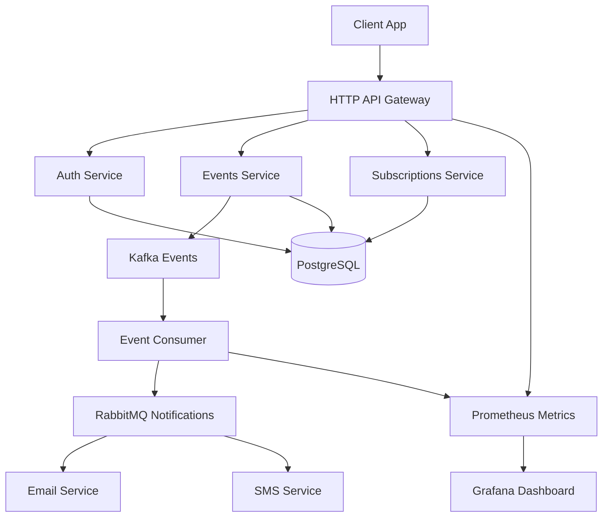
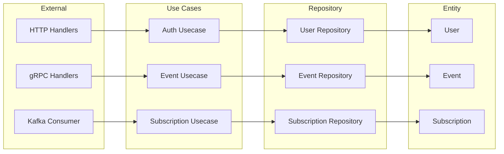

# EventFlow

[](https://golang.org)
[](https://github.com/TheFoxKD/eventflow/actions)
[](LICENSE)
[](https://goreportcard.com/report/github.com/TheFoxKD/eventflow)

EventFlow is a microservice system for event management and real-time notifications. Users can create events, subscribe to categories, and receive notifications through multiple channels.

## 🚀 Tech Stack

- **Backend**: Go 1.24, Clean Architecture
- **HTTP**: Chi Router, JWT Authentication
- **Database**: PostgreSQL with migrations (golang-migrate)
- **Messaging**: Kafka (events), RabbitMQ (notifications)
- **Communication**: gRPC with Protocol Buffers
- **Containers**: Docker, Docker Compose
- **Orchestration**: Kubernetes (KIND), Helm Charts
- **Observability**: Prometheus, Grafana, Loki

## 🏗️ Architecture



### Clean Architecture Layers



## 🐳 Quick Start with Docker

Clone repository:

```bash
git clone https://github.com/TheFoxKD/eventflow.git
cd eventflow
```

Copy environment file:

```bash
cp .env.example .env
```

Start all services:

```bash
make docker-up
```

Run database migrations:

```bash
make migrate-up
```

Check health:

```bash
curl http://127.0.0.1:8080/health
```

## 📡 API Endpoints

### Authentication

```bash
# Register
curl -X POST http://127.0.0.1:8080/auth/register \
  -H "Content-Type: application/json" \
  -d '{"email":"user@example.com","password":"password123"}'

# Login
curl -X POST http://127.0.0.1:8080/auth/login \
  -H "Content-Type: application/json" \
  -d '{"email":"user@example.com","password":"password123"}'

# Refresh token
curl -X POST http://127.0.0.1:8080/auth/refresh \
  -H "Content-Type: application/json" \
  -d '{"refresh_token":"your_refresh_token"}'
```

### Events

```bash
# Create event
curl -X POST http://127.0.0.1:8080/events \
  -H "Authorization: Bearer $JWT_TOKEN" \
  -H "Content-Type: application/json" \
  -d '{"title":"Tech Meetup","description":"Go microservices discussion","category":"tech"}'

# Get events
curl -H "Authorization: Bearer $JWT_TOKEN" \
  http://127.0.0.1:8080/events?page=1&limit=10

# Get event by ID
curl -H "Authorization: Bearer $JWT_TOKEN" \
  http://127.0.0.1:8080/events/{event_id}
```

### Subscriptions

```bash
# Subscribe to category
curl -X POST http://127.0.0.1:8080/subscriptions \
  -H "Authorization: Bearer $JWT_TOKEN" \
  -H "Content-Type: application/json" \
  -d '{"category":"tech"}'

# Get user subscriptions
curl -H "Authorization: Bearer $JWT_TOKEN" \
  http://127.0.0.1:8080/subscriptions

# Unsubscribe
curl -X DELETE http://127.0.0.1:8080/subscriptions/tech \
  -H "Authorization: Bearer $JWT_TOKEN"
```

## 🛠️ Development Setup

### Prerequisites

- Go 1.24
- Docker & Docker Compose
- Make

### Local Development

Install dependencies:

```bash
go mod download
```

Run tests:

```bash
make test
```

Run linter:

```bash
make lint
```

Build application:

```bash
make build
```

Run locally (requires external services):

```bash
make run
```

### Database Migrations

Create new migration:

```bash
make migrate-create name=add_events_table
```

Apply migrations:

```bash
make migrate-up
```

Rollback migration:

```bash
make migrate-down
```

## 🔧 Configuration

Environment variables (see `.env.example`):

| Variable | Description | Default |
|----------|-------------|---------|
| `DB_HOST` | PostgreSQL host | `127.0.0.1` |
| `DB_PORT` | PostgreSQL port | `5432` |
| `DB_NAME` | Database name | `eventflow` |
| `JWT_SECRET` | JWT signing secret | `your-secret-key` |
| `KAFKA_BROKERS` | Kafka broker addresses | `127.0.0.1:9092` |
| `RABBITMQ_URL` | RabbitMQ connection URL | `amqp://127.0.0.1:5672` |

## 🧪 Testing

Run all tests:

```bash
make test
```

Run with coverage:

```bash
make test-coverage
```

Run integration tests:

```bash
make test-integration
```

Run specific package tests:

```bash
go test ./internal/usecase/event -v
```

## 🚢 Deployment

### Docker

Build image:

```bash
docker build -t eventflow:latest .
```

Run container:

```bash
docker run -p 8080:8080 --env-file .env eventflow:latest
```

### Kubernetes

Deploy to KIND cluster:

```bash
make k8s-deploy
```

Port forward for testing:

```bash
kubectl port-forward svc/eventflow 8080:80
```

## 📊 Monitoring

- **Metrics**: <http://127.0.0.1:3000> (Grafana)
- **Logs**: Grafana Loki integration
- **Health**: <http://127.0.0.1:8080/health>
- **Prometheus**: <http://127.0.0.1:9090>
